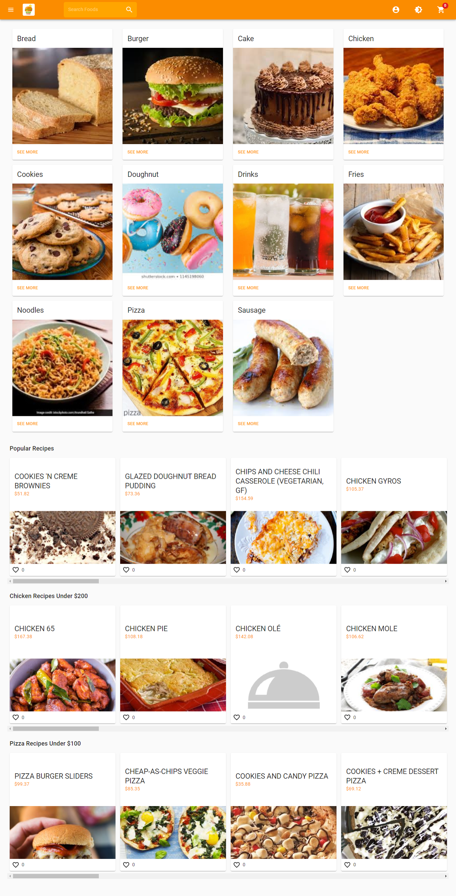

# REACT ECCOMERCE APP

It is a fullstack app where users can create account to place orders and leave their comments about their orders.
This is frontend source code for the app. For the backend source click [here](https://github.com/Ekenzy-101/Node-Ecommerce-Backend)
This project was bootstrapped with [Create React App](https://github.com/facebookincubator/create-react-app).

## TECHNOLOGY STACKS

- React
- Node
- GraphQL
- Stripe
- Express
- MongoDB

## SETUP

- Make sure you have your server setup. [For more info click here](https://github.com/ObasiGodstime/my-ecommerce-backend)
- Clone this repo by typing `git clone <repo url>`
- Go to the directory of repo by typing `cd <name of folder>`
- Type `npm install` to install all dependencies
- Set these environment variables
  `REACT_APP_API_URL=<Your Server Connection String>`
  `REACT_APP_STRIPE_SECRET_KEY=<Your Stripe Publishable Key e.g pk_test*....>`
